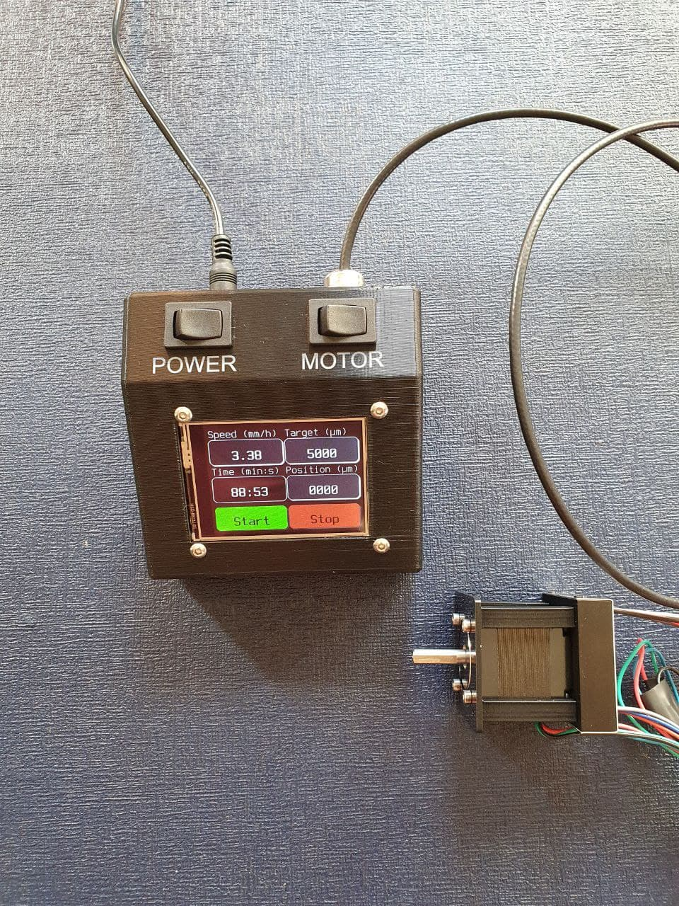

# Python-based ultra-slow stereotax controller

This repository describes a stereotax motor controller built for the SWC in November 2020. The setup consists of:

* Adafruit Pyportal Pynt (Adafruit #4465), which is an integrated touchscreen-microcontroller capable of running Circuitpython code.
* standalone stepper driver controller (Trinamic #TMCM-1070) 
* TMCM-1070-CABLE for connections. 
* bipolar stepper motor. Originally a small NEMA-11 motor was used. Later this was changed to a NEMA-17 for increased torque. A suggested model is the Trinamic #QSH4218-35-10-027.
* 12V 2A external power brick (generic)
* 5.5/2.1mm DC barrel jack to connect with the 12V supply (generic)
* 12V -> 5V converter, to power the Pyportal (Tracopower TSR-1-2450)
* M12 cable gland (generic)
* Optional but recommended: two toggle switches, one to control main power and one to enable/disable the motors.
* a 3D printed enclosure to house the Pyportal, switches and associated wiring.
* 2x JST-PH 3 pin cables, Adafruit #3894
* 1x JST-PH 4 pin cable, Adafruit #3950

## Wiring

| TMCM wire | Goes to                                                     | Cable colour |
|-----------|-------------------------------------------------------------|--------------|
| GND       | System GND                                                  | black        |
| V+        | 12V (via power switch)                                      | red          |
| DIR       | Pyportal pin D4 (JST connector). This pin doesn't have PWM. | blue         |
| STEP      | Pyportal pin D3                                             | yellow       |
| EN        | 5V via switch; motors enabled when conducting               | green        |
| CHOP      | Floating (if spreadcycle used); 5V if stealthchop used      | white        |
| COMM      | GND                                                         |              |
| RXD       | Not connected                                               |              |
| TXD       | Not connected                                               |              |

Note: in the version of the Pyport Pynt used in November 2020, the labels for D3 and D4 were reversed.

Power wiring: the 12V supply comes via the toggle switch and feeds to both the stepper driver, and the 5V converter. The 5V in turn powers the Pyportal via the 5V pin on the 4-pin I2C connector. It is pin 2. Consult the Pynt schematic for help. https://learn.adafruit.com/assets/86089

## Code

The code uses Circuitpython. The entire contents of the pyportal_code directory should be copied to to the Pyportal.

## 3D printed enclosure

The enclosure design file is on the SWC Fablabs Fusion team repository.

